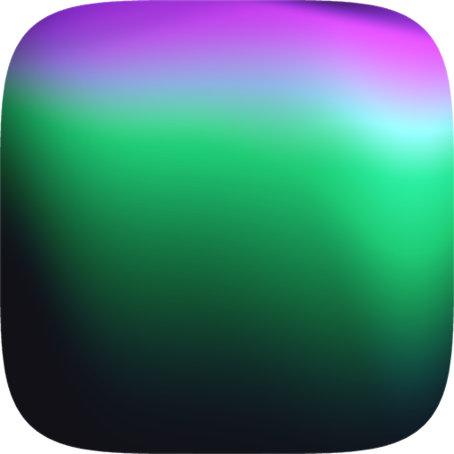
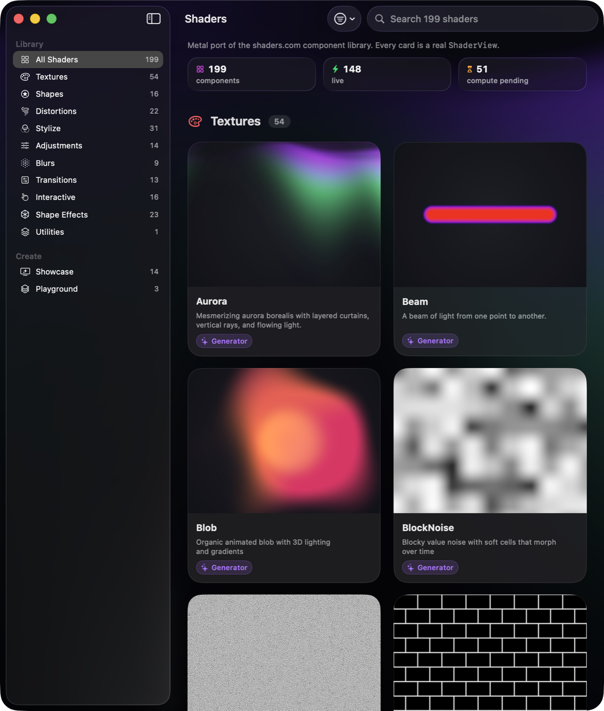
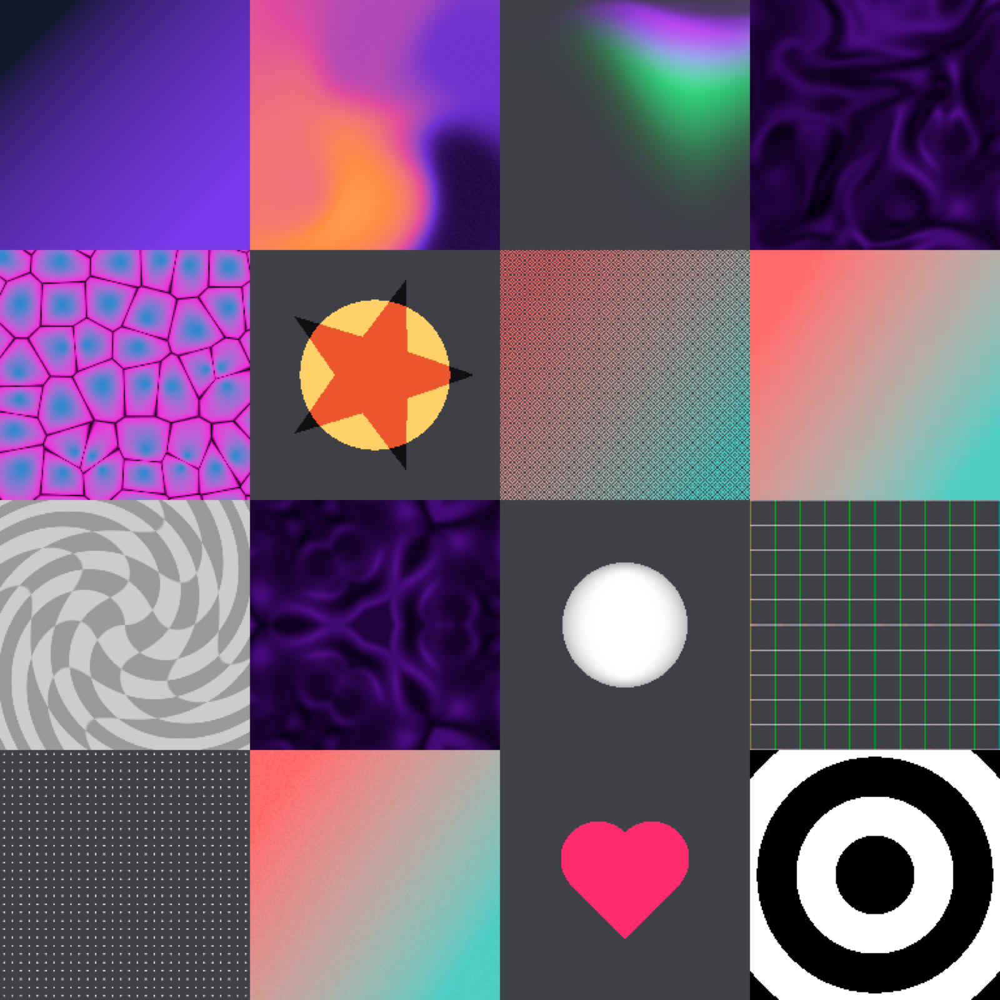
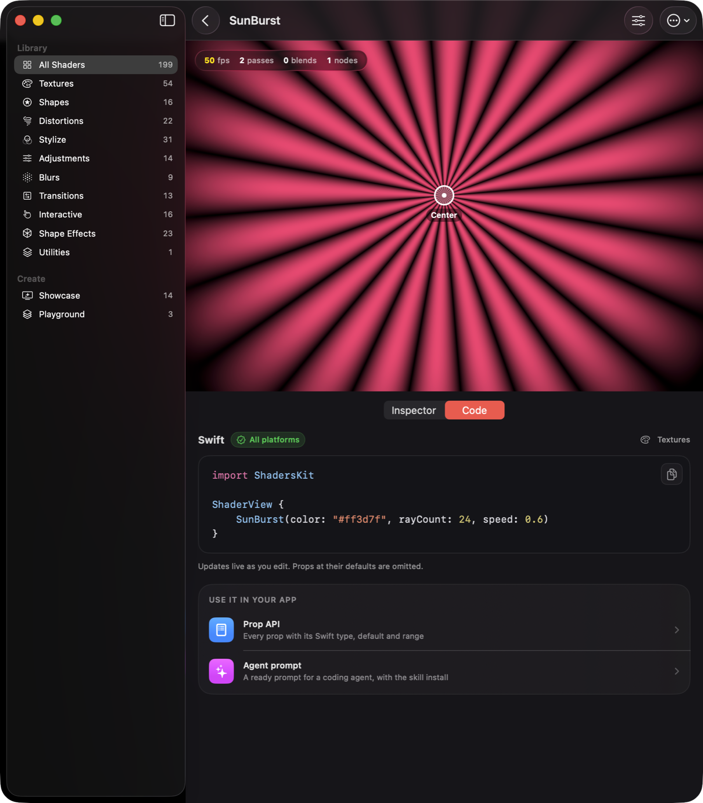
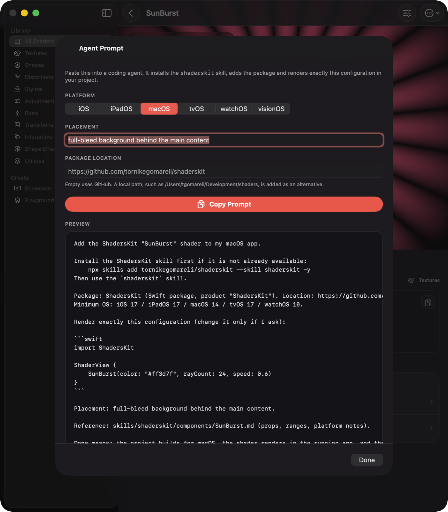
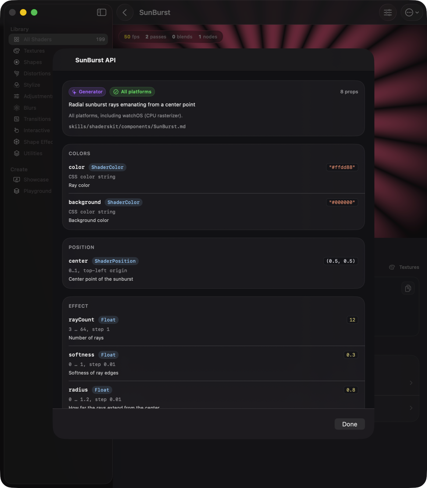
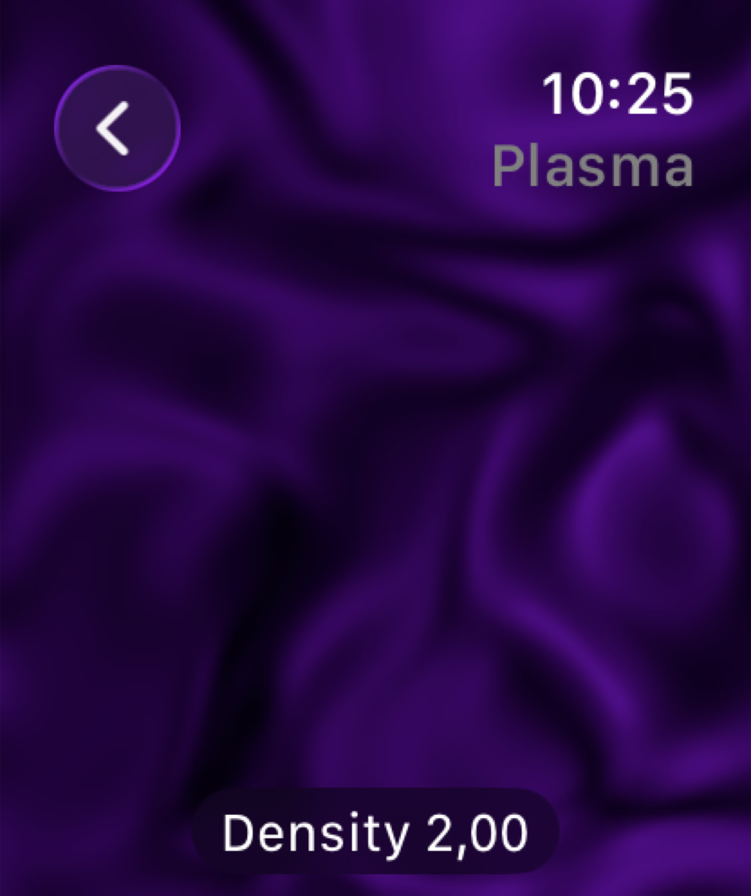
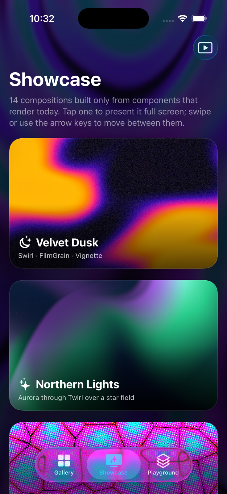
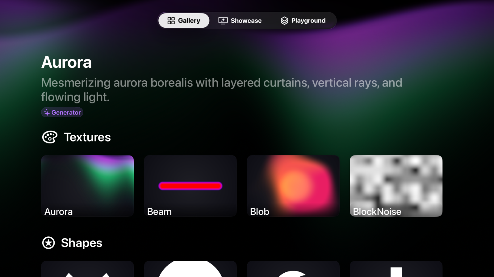
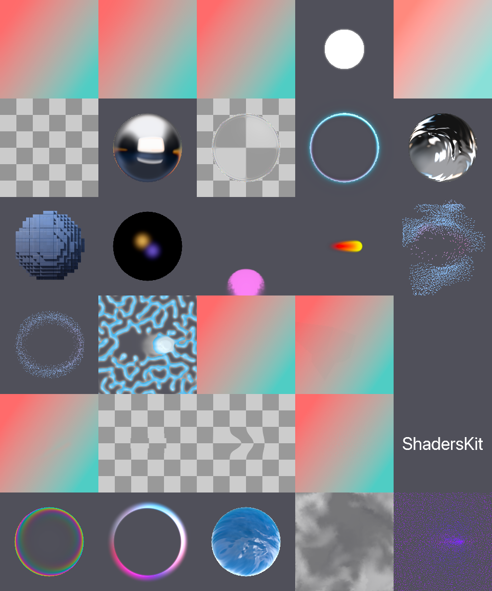

<p align="center">
  
</p>

<h1 align="center">ShadersKit</h1>

<h3 align="center">Every shaders.com effect, as a Swift view.</h3>

<p align="center">
  
</p>

ShadersKit is a Metal port of the [shaders.com](https://shaders.com) WebGPU component library. All 199 components are Swift structs with the same props and defaults as the web versions, rendered in a `ShaderView` on iOS, iPadOS, macOS and tvOS, and by a CPU rasterizer on watchOS. Gradients, noise, shapes, glass and metal materials, blurs, distortions, transitions, particle and fluid simulations.

## Write it like a view

```swift
import ShadersKit

ShaderView {
    MeshGradient()
    Vignette(intensity: 0.6) {
        Glow(intensity: 3, size: 60) {
            ShadersKit.Circle(color: "#ff2b6e", radius: 0.4)
        }
    }
    .blendMode(.screen)
    .opacity(0.8)
}
.frame(height: 320)
```

Layers stack top to bottom: the first one is at the bottom, each later one blends over it. Filters, distortions and materials wrap the layers nested in their closure. Colors are CSS strings, positions are 0…1 with the top-left origin, and select props are enums, so the editor's prop tables map one to one.

<p align="center">
  
</p>

## Let your agent add it

The demo app shows the code for whatever you are looking at, and a prompt you can hand to a coding agent. The prompt installs the `shaderskit` skill, names the package, and carries the exact Swift snippet for the props you set, so the agent reproduces what you saw.

<p align="center">
  
</p>

The skill lives in this repository and installs with the [skills CLI](https://skills.sh) into Claude Code, Codex, Cursor and the other agents it supports:

```sh
npx skills add InsaneArts/shaderskit --skill shaderskit -y
```

It carries the workflow, the platform notes, recipes, and a reference page for every component with its initializer, prop ranges and enums ([skills/shaderskit](skills/shaderskit)). A package test type-checks every snippet in it, so the docs cannot drift from the code.

<p align="center">
  
  
</p>

## Runs on the watch too

watchOS has no Metal, so the same shaders are transpiled to Swift and rasterized on the CPU at a reduced resolution. 146 of the 199 components run there; the compute-backed ones (blurs, simulations, SDF materials) need the GPU and stay Metal-only. `ShaderView` has the same API on every platform.

<p align="center">
  
  
  
</p>

## Install

Swift Package Manager:

```swift
dependencies: [
    .package(url: "https://github.com/InsaneArts/shaderskit", from: "0.1.0"),
]
```

Or in Xcode: File → Add Package Dependencies… and add the `ShadersKit` product to your target.

Requirements:

- iOS 17, iPadOS 17, macOS 14, tvOS 17 or watchOS 10 (the package also declares visionOS 1, but it is not built or tested there yet)
- Xcode 16 or newer
- `NSCameraUsageDescription`, only for `WebcamTexture`

Shaders compile from source the first time a component is used (the system caches the result afterwards). `ShaderDevice.shared?.precompileAll()` warms them in the background.

## Using it

- `ShaderView { … }` renders continuously and feeds the mouse, trackpad hover and touches to pointer-driven components. `isPaused` stops it; `preferredFramesPerSecond` lowers the cost of ambient backgrounds.
- `.blendMode(.multiply)`, `.opacity(0.7)`, `.mask("logo", type: .luminance)`, `.layerTransform(…)` and `.layerID("logo")` work on any layer.
- `ShaderNode(type: "LinearGradient", props: ["angle": .number(90)])` builds trees at runtime. `ShaderPreset` reads and writes the upstream `createShader` JSON, and `ShaderNode.swiftSource(for:)` turns a tree back into typed Swift.
- `ShaderRenderer(device:).renderImage(nodes, size:)` renders a still `CGImage` for thumbnails and exports.
- `ImageTexture`, `VideoTexture`, `WebcamTexture`, `Text` and a SwiftUI view capture (`HTMLInCanvas` with `ViewTextureRegistry`) bring media into the stack.
- Names that also exist in SwiftUI (`Circle`, `Text`, `LinearGradient`, `MeshGradient`, `Group`, `Grid`, `Glass`, `Mirror`, `Ellipse`, `RadialGradient`, `BlendMode`) are written `ShadersKit.Circle` in files that import both.

Not ported: the design editor's prop maps and mouse/auto drivers (animate props from Swift instead), flow layout, SVG-derived and flat 2D shapes inside the SDF materials, `Glass` frosted mode, non-cube `Voxels`, `TimeTrail` rainbow tint and `ReactionDiffusion`'s child-driven mode. watchOS approximates screen-space derivatives, so hairline anti-aliasing on grid-style components differs from the GPU.

## The demo app

`Demo/` is an XcodeGen project with iPhone, iPad, Mac, Apple TV and Apple Watch targets: the gallery of all components with live cards, an inspector generated from the prop metadata, a playground that stacks layers and exports Swift or JSON, curated showcases, a performance HUD, and the Code pane shown above.

```sh
cd Demo && xcodegen generate && open ShadersDemo.xcodeproj
```

Pick the `ShadersDemo-macOS` scheme (or `ShadersDemo`, `-tvOS`, `-watchOS`) and run. Launch arguments such as `-openShader SunBurst -detailPane code` jump straight to a screen; see [Demo/README.md](Demo/README.md).

## How it works

The upstream engine composes each component from a TypeScript DSL into WGSL at runtime. `Tools/upstream-dump` runs that composition GPU-free inside the upstream test harness and writes the resolved WGSL of every pass and compute kernel, for every compile-time variant, plus the prop metadata. `Tools/wgsl2x` parses and type-checks that WGSL, links the variants of a shader into one unit, and emits Metal Shading Language, Swift for the CPU rasterizer, the typed layer structs and the descriptor JSON. Every generated `.metal` file is verified with the Metal compiler, and the CPU and GPU paths are compared pixel-for-pixel in the tests.

What the generator cannot produce is the per-frame CPU side of the compute-backed components: which buffers exist, what each kernel reads, in which order they run. Those are ported by hand as `ComputeProgram`s in `Sources/ShadersKit/Engine/Programs`, one per upstream scaffold family ([Docs/PortingComputePrograms.md](Docs/PortingComputePrograms.md)).

<p align="center">
  
</p>

To regenerate from a newer upstream:

```sh
Tools/regenerate.sh            # clones upstream, dumps, transpiles, validates, rebuilds the skill docs
swift build && swift test
```

## Development

```sh
swift build
swift test                                            # 113 tests: renderer, CPU vs GPU, model, presets, every ported program
SHADERS_CONTACT_SHEET=/tmp/sheet.png swift test --filter ContactSheetTests   # renders a visual check
cd Demo && xcodegen generate                          # the demo project
```

The package has no dependencies. Generated files (`Sources/ShadersKit/Generated`, `Resources/MSL`, `Resources/Descriptors`, `skills/shaderskit/components`) are not edited by hand; change the generator in `Tools/wgsl2x` and regenerate.

## License

[MIT License](LICENSE). The upstream engine and components are MIT licensed by Shader Effects Inc.; the generated code keeps that license.
